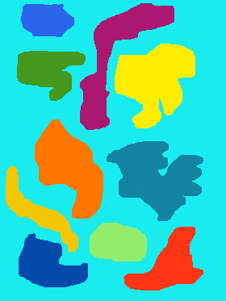

<tip: for better readability you can press ctrl or cmd key along with plus sign key for zooming in>

# Parallel Painting - Python explanation of a CUDA parallel painting algorithm

## Welcome!

Welcome to my first article!<br>
It is about a parallel painting algorithm I came up with some years ago and implemented in CUDA, executed on an NVIDIA GTX card. Although I haven't found anything similar back then when I was looking for a parallel painting solution, it is more like I reinveted the wheel. As you will see, it is more like a traditional 'log2N' algorithm than a big invetion.

In this article I will tell about this algorithm, show how it works with example animations, show how it can be executed on some paper with colored pencils. Don't worry if you are not expert in math or in programming, I will try to explain everything thoroughly and simply.

Instead of the original CUDA and C++ source code, which runs only on NVIDIA GPUs, I will also present some code in Python. Installing and using Python is fairly easy on any kind of computer or handheld device, I myself was working on this article entirely on my oldstyle MacBook Air, including all the Python work.
I'm also planning a follow up article which would be about the CUDA algorithm itself and would answer some questions I leave open here (data races, race conditions, these topics are more complicated).

Before the parallel algorithm, I will show a traditional painting algorithm, working on a single processor core.

### Color islands



The image on the right hopefully looks like some fancy colored islands in a calm sea, at least that was the goal when I tried to use my finger-painting skills on a small smartphone touchscreen.
I could draw black island outlines on a white screen with a simple application. The app had a paint function, which showed a tilted paint bucket filled with paint. I could move the bucket around with my finger, and also "pour out its content" with a button on the bottom of the screen. The application flooded all the white parts with light blue when I poured the carefully selected color for the sea outside of all island contours. Not yet knowing the colors of the islands, I moved the bucket inside all of the islands and poured black paint into all of them. This way I was also able to remove the outlines themselves as the islands turned all black.

&emsp;&emsp;&emsp;&emsp;&emsp;&emsp;&emsp;&emsp;&emsp;&emsp;&emsp;&emsp;&emsp;&emsp;&emsp;&emsp;&emsp;&emsp;&emsp;&emsp;&emsp;&emsp;&emsp;&emsp;&emsp;&emsp;&emsp;&emsp;&emsp;&emsp;&emsp;&emsp;&emsp;&emsp;&emsp;&emsp;&emsp;&emsp;&emsp;&emsp;&emsp;&emsp;&emsp;&emsp;&emsp;&emsp;&emsp;&emsp;&emsp;&emsp;&emsp;&emsp;&emsp;&emsp;&emsp;&emsp;&emsp;&emsp;&emsp;


<br>
I can not say I had a clear plan about the colors of the islands, but started to move around the bucket, set the color of its paint and tapped the 'pour out' button when the bucket was over a black area. The application relentlessly turned the black islands into color ones.
The painting process looked instantaneous, the paint flooded an island in a blink of an eye. It is quite convenient from the user's point of view, however, let us be honest, it is not quite realistic. At least all paint or liquid I've ever seen was flowing way much slower than the speed of light (hopefully I didn't miss something and this is always the case).
I guess you wouldn't be so surprised if I was telling that the "paint" in the application is also flowing in some direction or directions, flooding everything until it hits the sea, which acts as a wall. It either stops the paint in that certain direction, or more probably redirects it to other black areas, if anymore is left at all in the neighborhood.
Sounds pretty complicated! Thankfully or sadly even small devices like smartphones are fast enough to do this complex task immediately.
If you are courius about how this painting process works under the hood, you are just like me! If not, further reading of this article can bring up your interest.
I don't know how the particular paint filling in the app works, not least because it paints instantly, but I have hazy memories from my childhood, when things were slower, especially computers. You could easily follow the painting process, sometimes for long tens of seconds. If I remember correctly they more looked like brush strokes. Pixels were drawn up then down between the outlines, stepping one pixel to the sides after each vertical stroke.
What I'm completely sure about that pixels were painted one by one, only one pixel was drawn at a time. It is completely understandable, as processors could do only one thing at a time, they had single cores only. Nevertheless, designing an algorithm for one core is usually simpler. How could 8 or 16 cores help us out here? Can a brush stroke draw 8 pixels at once? What if one of the pixels hits the outline, how would the other pixels know that they should not be drawn as they would fall outside? Similarily, could we have 16 brush strokes at once? These are some of the questions came to my mind. Well, I'm sure there are clever answers to them, but I'm afraid they are rather complicated answers. So I would recommend us to stick ourselves to a one-step-at-a-time method when we are thinking about a simple solution.
Now I can hear you asking why I'm talking here about a simple one thread (one core) solution, when you arleady read the title and preface of this article. Spoiler alert: yes, I will introduce my paralell algorithm later on in this article, wich runs on thousands of cores of a GPU at once (!), manipulating thousands of pixels at a time! That will be another story, will look more like a flood fill, for now, let me introduce first a 'classic', one pixel at a time, brush stroke like algorithm to see the contrast between the two.

### A single core painting algorithm

Thinking back to old brushstroke algorithms, I don't remember exactly how an entire shape was filled with pixels. Just imagine, we specify the starting point inside a rectangle shape, pixels starts to appear upwards with a given color, then downwards one pixel to the left, then up again to the left again until we reach the left side of the shape. But what about the other side, the right one from the starting point? If I remember correctly, after the left side was painted, pixels started to appear downwards from the starting point, then upwards one pixel to the right, all the way to the right side. It was a kind of 'restart' from the starting point. Now you can imagine what is it like having a more complex shape. Such as a rotated or lying **H** shape, one thin vertical rectangle with two thin horizontal rectangles on its bottom and top. That must have like 3 'restarts' from 3 different pixels. It doesn't sound as a simple algorithm, it must be quite complex!<br>
I was already thinking about this process for this article, when I asked my lazy programmer self about his (my) opinion. It is indeed complex, but let's outsource the complex 'restart' part of the method to the machine!
Let's start with easier things, moreover, let's start in the very beginning! We are given a pixel coordinate to start somewhere inside a black island on an image, and also a color so that we know which color to use for drawing pixels.
We could write this Python function header:
```python
def paint(image, x, y, color):
```
Can we simply paint the given pixel with the specified color in the very first step? Surely, but we need to be cautious. If the pixel at the given coordinates is not black for some reason, because it is a blue sea pixel or an already painted island pixel, we should not paint it. Also, the painting process itself should not be started. In this case, we will simply return from the paint function. Otherwise, we can paint the pixel to the given color.<br>
If you feel like something is missing, an error message for the fail case or the sanity check of the x and y coordinates, your intuition is right! However, I would skip the sanity check for simplicity and I should skip the error message for reasons you are about to see.
So, if the given coordinates point to a pixel inside a black island, we can paint the first pixel. So far, so good! But what about the others? Should we go up one pixel, down, or what? Now let's see the simple approach of my lazy programmer self.
Where are the remaining black pixels? Around the pixel we have alredy painted! Great situational awareness, but what can we do with this information? Let's say, we never go too far, inspecting only the pixels around the already painted pixel. Ideally they are all black, or at least most of them. Let's try to paint all the neighbors around the painted pixel, one by one. We take one neighbor by its coordinates and if it is not black (not already painted or sea pixel), we don't do anything with it. If it is black, we paint it to the given color.
Sounds familiar? Yes, we have just done the same with the first pixel! And here comes the trick: after we paint a pixel, we always take all its neighbors again and do the exact same with those pixels one by one. If possible, paint it to the given color and take its neighbors one by one again.
I know it sounds ridiculous, mostly because one of the neighbors of a pixel neighbor is the pixel itself, which is already painted (hope I haven't lost you at this point and you are still with me). It is not a problem, since we always need to check every pixel before painting anyway.
As the task is the same for the first pixel and all the pixels around it, we can simply call the paint function itself inside the paint function, for all neighboring pixels. Calling a function inside that particular function may sound like a recipe for a trouble, coming in the form of a nice infinite loop, and it certainly can be if a function always calls itself. However, we already have a case when we don't need to check the neighbors. It is when the pixel we are working on is an already painted or a sea pixel. In that case we return from the function without calling it again.

Sounds good, let's see the whole function in Python!

```python
def paint(image, x, y, color):
    if image[y,x] == black_color:
        image[y,x] = color
        paint(image, x    , y - 1, color) # neighbor above
        paint(image, x    , y + 1, color) # below
        paint(image, x - 1, y    , color) # to the left
        paint(image, x + 1, y    , color) # to the right
        paint(image, x - 1, y - 1, color) # top left neighbor
        paint(image, x + 1, y - 1, color) # top right
        paint(image, x - 1, y + 1, color) # bottom left
        paint(image, x + 1, y + 1, color) # bottom right
    return
```
> **_Note:_**
> - `image` is a 2D numpy array of color code numbers, the image of islands
> - `color` is a color code number between 0 and 11, 0 means black, 1 is the sea color, numbers between 2 and 11 represent island colors
> - `black_color` is 0
> - as usual, x is the horizontal axis, y is the vertical
> - indexing a 2D numpy array is a bit tricky, y comes first, x is the second
> - numpy arrays are mutable, which means any modification of the array inside the function is also seen from outside (passed by reference in C++ terms)


You can see 8 self-function calls inside the function as all pixels have 8 neighbors around.
Smart people have already named these kind of self-calling functions as recursive functions, because they recursively call themselves most of the time. Don't worry if you are not familiar with this concept, and don't immediately trust anyone who claims to know how and when the calls and returns occur in a small but rather complicated recursive function like this one. Often, as in our case, this is not known in advance, since it depends on what data the function is working on. In our case, this data is the shape of the island and the location of the starting point. The path of function calls and returns is automatically handled by the machine. With recursion, the only thing we need to care about is the maximum depth, that is, the number of times the function calls itself before a return happens. In our case, it can be a few thousand, which is more than the thousand recursion depth allowed by default in Python.<br>We can easily change this upper limit:

```python
import sys
sys.setrecursionlimit(4000)
```

Let's see how this recursive paint function works, I mean literally see it!


The first thing that really stands out is that this process really looks like what I was talking about, recalling my memories. Not always, but most of the time the pixels go up and down, mimicking up and down brush strokes, even if there is no explicit code to do so in the function. If this doesn't surprise you, you are already an expert in recursive functions! As I've already stated, the path of the recursion is heavily dependent on the data, on the shape of the island and on the location of the starting point. However, we can easily influence the process by the order of the function calls, that is, the order of neighbors to inspect. I've intentionally placed the investigation of the upper and lower neighbors first. Don't forget, we have only one core here, the function can cope only with one pixel at a time. Instead of taking the neighbors of a pixel one by one, the process takes the first neighbor, which is the upper one, then takes the upper neighbor's first neighbor, which is its upper neighbor (assuming those neighbors are still black). That results in the brush stroke up. If going up is not possible, the second function call kicks in, resulting in a brush stroke down. You can also see the 'restarts', they are handled automatically. These restarts can occur when many functions return from each other, because all neighbors have already been checked and they were either skipped or painted. Visually, this is when a part of the island is alredy fully painted and the brush stroke can not continue in that area.

&emsp;&emsp;&emsp;&emsp;&emsp;&emsp;&emsp;&emsp;&emsp;&emsp;&emsp;&emsp;&emsp;&emsp;&emsp;&emsp;&emsp;&emsp;&emsp;&emsp;&emsp;&emsp;&emsp;&emsp;&emsp;&emsp;&emsp;&emsp;&emsp;&emsp;&emsp;&emsp;&emsp;&emsp;&emsp;&emsp;&emsp;&emsp;&emsp;&emsp;&emsp;&emsp;&emsp;&emsp;&emsp;&emsp;&emsp;&emsp;&emsp;&emsp;&emsp;&emsp;&emsp;&emsp;&emsp;&emsp;&emsp;&emsp;&emsp;

Let's see what happens if the order of the calls is different. In this scenario, we would start with the top-left neighbor and then proceed clockwise.
> _**fun fact:** This was my original attempt at this recursive paint function. Later I rearranged the calls as I was progressing with this article and started writing about oldschool algorithms._


Not surprisingly, the first brush stroke goes diagonally up to the left. Then it turns to other, seemingly unpredictable directions.

The second thing that is quite obvious is that this painting process is slow. Here it takes minutes, although the pixels appear quickly one after another. I set the pixel rate to 30 pixels/second for these demonstrations. 3 pixels in one tenth of a second! However, the overall process looks slow. It is because we have many pixels on an island. The whole image of islands has 280x372 pixels, an island would roughly fit in a 100x100 pixel square. 100 doesn't seem like a lot, but its square is another order of magnitude, it is 10 000 pixels. In fact, the first island of the demonstaration consist of 5758 pixels, the other one 6696 pixels. Their width and height have similar order of magnitude, let's denote it with $n$. Their square is another order of magnitude, we can denote it with $n^2$. If we see an island that is twice as tall and wide as another, we percieve it as twice as large, even though it has 4 times as many pixels. An island that looks 20 times bigger has 400 times more pixels!

&emsp;&emsp;&emsp;&emsp;&emsp;&emsp;&emsp;&emsp;&emsp;&emsp;&emsp;&emsp;&emsp;&emsp;&emsp;&emsp;&emsp;&emsp;&emsp;&emsp;&emsp;&emsp;&emsp;&emsp;&emsp;&emsp;&emsp;&emsp;&emsp;&emsp;&emsp;&emsp;&emsp;&emsp;&emsp;&emsp;&emsp;&emsp;&emsp;&emsp;&emsp;&emsp;&emsp;&emsp;&emsp;&emsp;&emsp;&emsp;&emsp;&emsp;&emsp;&emsp;&emsp;&emsp;&emsp;&emsp;&emsp;&emsp;&emsp;

Even with a fast machine that can process, say, 100 000 pixels a second, it would take roughly 1 second to paint all the islands on the black islands picture. Processing $n^2$ pixels is simply too much, considering we can only deal with one pixel at a time. We can say that an algorithm that executes a task $n*n$ times is too time-complex. There is even a special notation which tells how time complex an algorithm is, it is the big O notation. This is denoted either with a simple capital O or with a fancier open O at the top:

$$O(n^2)$$
$$\\mathcal{O}(n^2)$$

$O(n^2)$ algorithms are quite slow, they need optimization if possible. $O(n*log(n))$ complexity is usually a reachable goal for them and is better, $O(n)$ is even better, $O(log(n))$ algorithms are pretty fast. There are also $O(1)$, constant time algorithms or operations, they are the fastest ones. On the other hand, we have very slow algorithms such as $O(n^3)$, $O(2^n)$, or even $O(n!)$, to name a few (I think permutation is a good example for the latter).<br>
In our case, the only possibility to speed up the painting algorithm is to process more than one pixel in one step. This is what we are going to do in the parallel painting algorithm. However, that will be a different algorithm. Parallelizing our recursive function would be inefficient for many reasons.

> _**fun fact:** Although the time complexity of my parallel algorithm will be better, the algorithm itself will be more complicated, consisting of several steps and more than one functions. This is quite common, parallelization always involves some overhead._

That may sound like a recipe for trouble, and it certainly can be if we are not careful. <- quote from Barron Stone
$$ O(n^2) $$
$$ O(log_2(n)) $$
$$ \\mathcal{O}(log_2n) $$

### The parallel painting algorithm

Here comes my parallel algorithm, which was originally written in CUDA and C++ and ran on GPUs with a few thousand cores. As I already mentioned, we will still use Python in this article, so although the algorithm will be basically the same, it won't run in parallel.

The original CUDA algorithm is a short chain of certain steps, these steps are executed serially. In each step functions are executed on the GPU (they are CUDA kernels in CUDA terms). I created two functions, they are executed alternately during the iteration. The only exception will be the first step of the iteration, when only one of the functions will be called. Each function has as many instances on the GPU during processing as many pixels we have on the image. This also means that all islands will be painted at once! In theory, all pixels are processed in parallel with these functions, more precisely, with their instances on each core. I will tell more about the practice later on.

Now you may be wondering, how to assign starting points and different colors to the islands, if we paint them all at once. With this algorithm, no starting points need to be assigned at all, and colors do not need to be assigned before the painting process. The algorithm fills the islands with arbitrary numbers. These numbers will be the same on one island, but completely different from the numbers on the other islands.

Enough talk, let's see how it works! Let me use a real notebook and real pencils to explain the steps of the algorithm. For the sake of simplicity, the toy example here will be my original first example with only 6x6 pixels and one island first.


>_**fun fact**: I was drawing and writing a lot of numbers in a similar notebook when I came up with this algorithm. The one island example here will be exactly the same as the one I came up with years ago. It happened after many tries and even with this example it took me a while to get the algorithm right._

First I draw a grid that represents the 6x6 image. I number all the pixels in the upper left corner with blue pen, in ascending order. I apologize in advance, if I refer to these blue numbers as slot numbers (I drew the pixels so big they look like slots).

Now comes a trick, a very first preparatory step before the paint iteration. Let's write these numbers in big black in the pixels representing the islands (black pixels considering the examples of the single-core version). The sea pixels remain blank, but since I bought a fancy teal pencil, I would shade them with sea color. Note, instead of black pixels, each island pixel has a distinct number, and these numbers are in order.

During the iteration, we will work in certain areas of the image. We start with small areas and increase their sizes as the iteration goes on. I draw these areas with my red pencil. As you see on the picture these areas also form a grid. An area is 2x2 pixel large in the beginning.

For this demonstration, I will show the two functions of the iteration steps as two substeps.
In the original CUDA algorithm, all the pixels are processed at the same time. As we can not do the same in the Python version and I'm only good with one hand and one pencil, I will do the algorithm tasks for one pixel at a time. The order doesn't matter, however, in the Python implementation I use the order of the slot numbers. I'm going to use the same order in the notebook for these demonstration videos, and I will cover some interesting things to note about the parallel or different order scenarios.

Let's start the iteration, with the first substep to do. We take all the island pixels and inspect their island pixel neighbors within the red area. It is important to take the only neighbors into consideration which are located in the same are. If the smallest value around the island pixel is less than the value of the pixel, we take note of it.

I will write down all the pairs of pixel values and smaller neighbor values, with a $<$ sign as you see on the demonstration video. I will refer to the values on the two sides of the $<$ sign as left and right values.

After having all the individual pairs, we can finish the first substep. I take all the value pairs wrote down one by one. The right larger numbers show the slots we need to modify. I take a pair, find the slot number according to the right value, and replace the pixel value in the slot with the left smaller value of the pair. I know it sounds a bit cumbersome, because the slot numbers and the pixel values in the slots are the same. However, it will not be the case in later steps. Thus, it is important to see the right side values of the pairs as slot number (in fact, the left values also refer to slot numbers, but their pixel values will always be the same as their slot values).

Now, it is worth to mention, that even in our Python implementation these seemingly two subtasks (identifing pairs, *then* modifing values with them) will be done in one step for each pixels. In the Python implementation we take all pixels one by one, check their neighbors, and if there is a smaller one, we immediately modify the small value slot.
In this iteration step this sounds good enough to do so, but in later steps this can and will raise questions.

> __thoughts for the paralell version:__ !!TODO!! NOT here, in later steps!

And we are done with the first iteration step! As I mentioned earlier, we silently skipped here a second substep which could have also been performed for the first iteration step, however, it would have had no effect. Let's go on with the second iteration step, where I will also reveal the second substep and why it is unnecessary for the first iteration step.

For the next iteration step, we double the sides of the areas, now they are 4x4 pixel in size, see my red lines. Note, almost all areas except the first one stick out since the image is only 6x6 pixels, but that's not a problem at all. I even left them open on my drawing in the notebook, doesn't matter. The rules are the same for the first task. We are looking for the smallest value neighbor of each pixel. If the smallest neighbor is smaller than the pixel value, we take note of it. Only values that are in the same area as the pixel can be neighbors.
We evaluate our notes the same way, as in the first iteration step.

!!! questions arisen here, root values here

Despite the task is exactly the same as in the first iteration step, now many interesting things start to reveal its true face. As I mentioned earlier, right hand values in our notes must be considered as slot numbers. Now it makes sense, see the values 13 for example in slot 13, 14, 19, and 20. We don't change all of them to 1 just because we have the note 1 < 13. We change only one of them, the one which is in slot 13. Let me call the value in slot 13 as the 'root' for all 13 values. This root changes from 13 to 1, this will be the new root for all values of 13. If you are wondering why don't we change all 13 values to 1, only the root, I can assure you that they will all be changed. However, it is not done by the first substep, it will be handled by the second one, which is about to introduced. Remember, in the implementation of the algorithm these two subtasks (take notes, then evaulate them) are done in one step for each pixel. It would be slow to take and evaulate notes and would also cost extra memory. Changing all 13 values and checking for neighbors in one parallel step would present additional challanges.

TODO: ideologies later please
I think the best summary for the first task is to change the root of !TODO think it over: root of what? similar values? from when they are exists?

And with this I've already revealed the sole goal of the mysterious second step. This substep takes all pixel values, and change them according to their roots. Its way of working is quite simple. For each pixel, we take its value and look up its root, which is the value in the slot with the same number as the pixel value. I can imagine your eyes widen after reading the last sentence, hopefully it sounds more funny than complicated. Don't worry if the latter is the case, I'm trying to demonstrate this root lookup thing with my pencil, hopefully this makes it clearer (at least a bit). Now if it is clear, I'm ready to increase the funniness (or the complexity) of this substep. After we found the root value for the pixel, we will not immediately replace the pixel value with the root value. First we make sure, that the root value and the slot number of the slot where the root value resides are the same. If not, we look up the root value of the root value we already found. Anybody who is still with me and finished her or his loud laughter can see this in a more understandable way with values borrowed from my example. Let's say we process the pixel in slot 19. It has the value 13. Now we turn our attention to slot 13, which has the value 1. Slot number 13 and its value 1 is not the same, so now we turn our attention to slot 1 (as the root value in slot 13 was 1). Slot number 1 has the (root) value 1, the two numbers are the same. After all this, we can safely modify the pixel value of slot 19 from 13 to 1. If you find this last step with looking up slot 1 unnecessary, see the appendix for more explanation.


> **Note:** If you can't find the proper definition of 'root' in the article, it is my fault: I did not give one. Let's say all pixels have a root slot, the slot with the same slot number as the pixel value. The root slot, as an ordinary pixel, also has a value. I named this value as the root value. Note how the root values are the same as pixel values in the very beginning, when we put the initial increasing numbers into our black islands.

